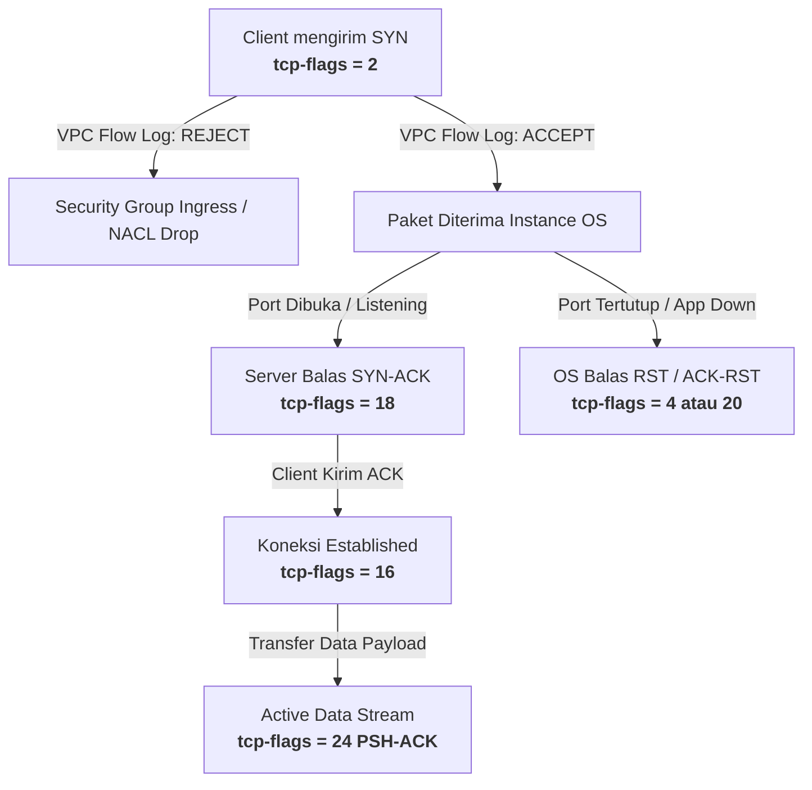
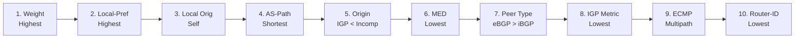
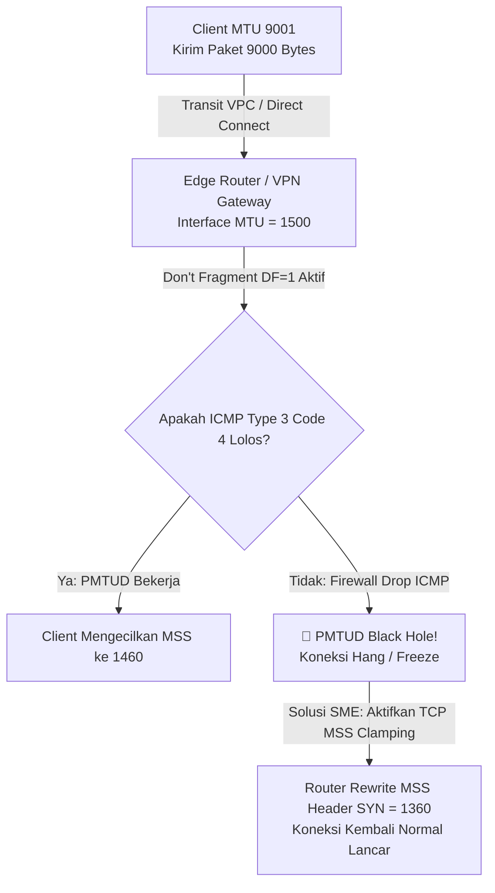

# SME Quick Reference & Printable Cheat Sheets

<div class="hero-badge">
  <span>SME Production Field Reference • RFC & AWS Enterprise Standard</span>
</div>

Halaman ini dirancang sebagai **referensi cepat satu halaman** (Printable / PDF Ready) untuk Senior & Principal Cloud Network Engineer. Memuat intisari formula matematis, bitmask desimal, matriks seleksi rute, dan nilai MTU/MSS yang paling sering diuji dan digunakan dalam operasi *War Room* produksi.

<ClientOnly>
  <PrintButton />
</ClientOnly>

<div class="grid-2 no-print">
  <div class="stat-box">
    <div class="stat-label">Navigasi Cepat</div>
    <div class="text-sm flex flex-col gap-1 mt-1 font-medium">
      <a href="#0-kamus-singkatan-akronim-jaringan-sme-glossary" class="text-blue-500 hover:underline">0. Kamus Singkatan & Akronim Jaringan (SME Glossary)</a>
      <a href="#1-tabel-dekode-desimal-flag-tcp-vpc-flow-logs-wireshark" class="text-blue-500 hover:underline">1. Dekode Desimal Flag TCP (VPC Flow Logs)</a>
      <a href="#2-matriks-ringkas-13-step-bgp-best-path-selection" class="text-blue-500 hover:underline">2. Matriks 13-Step BGP Best Path Selection</a>
      <a href="#3-kamus-aws-bgp-community-tags-direct-connect-vpn" class="text-blue-500 hover:underline">3. Kamus AWS BGP Community Tags</a>
      <a href="#4-matriks-mtu-mismatch-rekomendasi-mss-clamping-per-tipe-link" class="text-blue-500 hover:underline">4. Matriks MTU Mismatch & Rekomendasi MSS</a>
      <a href="#8-matriks-global-ingress-aws-global-accelerator-anycast-routing" class="text-blue-500 hover:underline">8. Matriks Global Ingress & AWS Global Accelerator</a>
    </div>
  </div>
  <div class="stat-box">
    <div class="stat-label">Spesifikasi Dokumen</div>
    <div class="text-xs text-[var(--vp-c-text-2)] leading-relaxed mt-1">
      <strong>Target:</strong> Produksi SEV-1, Desain Arsitektur & Sertifikasi SME.<br/>
      <strong>Protokol:</strong> RFC 793, RFC 4271, RFC 1997, RFC 4360, RFC 1191, RFC 8926, RFC 4632.<br/>
      <strong>Cetak:</strong> Klik tombol di atas untuk cetak otomatis format A4 / PDF.
    </div>
  </div>
</div>

---

## 0. Kamus Singkatan & Akronim Jaringan (SME Glossary)

<ClientOnly>
  <GlossaryExplorer />
</ClientOnly>

---

## 1. Tabel Dekode Desimal Flag TCP (VPC Flow Logs & Wireshark)

Dalam **AWS VPC Flow Logs** versi custom (`${tcp-flags}`) dan penganalisis paket (*packet capture*), TCP Control Flags dilaporkan dalam bentuk **integer desimal tunggal** yang merupakan hasil penjumlahan bitmask bit flag (OR operation) dari 8-bit TCP control field.

$$\text{Nilai Desimal} = \sum (\text{Bit Flag Aktif}) = (\text{CWR}\cdot 128) + (\text{ECE}\cdot 64) + (\text{URG}\cdot 32) + (\text{ACK}\cdot 16) + (\text{PSH}\cdot 8) + (\text{RST}\cdot 4) + (\text{SYN}\cdot 2) + (\text{FIN}\cdot 1)$$

### A. Bobot Desimal Setiap Bit Flag Murni (RFC 793 / RFC 3168)

| Flag | Posisi Bit | Nilai Desimal | Hexadecimal | Fungsi Utama & Perilaku Jaringan |
| :--- | :---: | :---: | :---: | :--- |
| **FIN** | Bit 0 ($2^0$) | **`1`** | `0x01` | **Finished**: Pengirim telah selesai mengirim data; memulai *graceful connection teardown*. |
| **SYN** | Bit 1 ($2^1$) | **`2`** | `0x02` | **Synchronize**: Menginisiasi 3-way handshake dan sinkronisasi sequence number awal (ISN). |
| **RST** | Bit 2 ($2^2$) | **`4`** | `0x04` | **Reset**: Memutus koneksi secara paksa (*hard reset*); port tertutup atau error state. |
| **PSH** | Bit 3 ($2^3$) | **`8`** | `0x08` | **Push**: Menginstruksikan penerima untuk segera meneruskan buffer ke aplikasi (tanpa menunggu penuh). |
| **ACK** | Bit 4 ($2^4$) | **`16`** | `0x10` | **Acknowledgment**: Kolom *Acknowledgment Number* dalam header TCP valid. |
| **URG** | Bit 5 ($2^5$) | **`32`** | `0x20` | **Urgent**: Kolom *Urgent Pointer* valid (prioritas pemrosesan data darurat). |
| **ECE** | Bit 6 ($2^6$) | **`64`** | `0x40` | **ECN-Echo**: Sinyal adanya kongesti jaringan (RFC 3168) atau negosiasi ECN pada SYN. |
| **CWR** | Bit 7 ($2^7$) | **`128`** | `0x80` | **Congestion Window Reduced**: Pengirim mengonfirmasi telah memperkecil Congestion Window ($cwnd$). |

---

### B. Kombinasi Desimal Paling Sering & Interpretasi Root-Cause

| Nilai Desimal | Formula Bitmask | Flag Aktif | Skenario Flow Logs / Status Koneksi | Root-Cause & Langkah Investigasi SME |
| :---: | :---: | :---: | :--- | :--- |
| **`2`** | $2$ | **SYN** | Inisiasi koneksi baru oleh client (*Handshake Step 1*). | • Jika action **`REJECT`**: Paket diblokir oleh **Security Group Ingress** atau **NACL**.<br/>• Jika **`ACCEPT`** tanpa balasan: Routing black hole / host tujuan mati. |
| **`18`** | $16 + 2$ | **SYN + ACK** | Respon persetujuan koneksi dari server (*Handshake Step 2*). | Server mendengarkan port (*listening*). Jika client terus mengulang SYN, periksa *asymmetric routing* pada jalur pulang. |
| **`16`** | $16$ | **ACK** | Penyelesaian handshake (*Step 3*) atau ACK data stream. | Sesi TCP berstatus `ESTABLISHED`. Menunjukkan throughput data mengalir normal di kedua arah. |
| **`24`** | $16 + 8$ | **ACK + PSH** | Pengiriman payload data aktif (HTTP GET/POST, SQL query, SSH). | Paket memuat data aplikasi nyata yang langsung di-push ke daemon penerima. |
| **`4`** | $4$ | **RST** | Hard reset dari pengirim tanpa *acknowledgment*. | • Jika log mencatat action **`ACCEPT`** lalu muncul **`4`**: Security Group mengizinkan paket masuk, tetapi **service/port di dalam OS host dalam keadaan DOWN/CLOSED** (*Connection Refused*)! |
| **`20`** | $16 + 4$ | **ACK + RST** | Penolakan koneksi aktif / pembatalan sesi TCP yang ada. | Dikirim oleh OS atau firewall stateful jika menerima paket data untuk sesi yang sudah kedaluwarsa (*stale state table*). |
| **`17`** | $16 + 1$ | **ACK + FIN** | Penutupan koneksi secara normal (*4-way handshake teardown*). | Salah satu pihak memulai penutupan soket secara teratur (`CLOSE_WAIT` / `FIN_WAIT_1`). |
| **`1`** | $1$ | **FIN** | Penutupan koneksi murni (tanpa piggybacked ACK). | Transisi state FIN awal dari initiator teardown. |
| **`66`** | $64 + 2$ | **SYN + ECE** | Client mengumumkan dukungan ECN (*Explicit Congestion Notification*). | Inisiasi negosiasi ECN modern pada kernel Linux / Windows terbaru. |
| **`82`** | $64 + 16 + 2$| **SYN + ACK + ECE** | Server mengonfirmasi dukungan ECN aktif. | Jalur end-to-end mendukung deteksi kongesti L3/L4 tanpa packet drop. |
| **`194`**| $128 + 64 + 2$| **SYN + ECE + CWR** | Probe inisiasi ECN penuh RFC 3168. | Pengujian kemampuan router transit terhadap bit ECN. |



---

## 2. Matriks Ringkas 13-Step BGP Best Path Selection

Algoritma pemilihan rute terbaik BGP (*BGP Decision Process* - RFC 4271) dijalankan secara sekuensial dari Step 1 hingga Step 13. Begitu satu step menghasilkan satu pemenang unik, evaluasi langsung berhenti (**First match wins**).



### Matriks Evaluasi Lengkap & Implementasi di AWS Cloud

| Step | Atribut BGP | Aturan Seleksi | Default Value | Cakupan Propagasi | Implementasi AWS Direct Connect & Cloud WAN |
| :---: | :--- | :--- | :---: | :--- | :--- |
| **1** | **Weight** | **Tertinggi Menang** | `0` (Learned)<br/>`32768` (Local) | Lokal Router (Non-transitive) | Proprietary Cisco/Vendor. Digunakan pada on-premises CE router untuk memilih Primary Edge router. |
| **2** | **LOCAL_PREF** | **Tertinggi Menang** | `100` | Seluruh iBGP AS (Transitive) | **Sangat Kritis di AWS!** Dikontrol via BGP Community Tags `7224:9100` (70), `7224:9200` (80), `7224:9300` (90). |
| **3** | **Locally Originated** | **Rute Lokal Menang** | - | Lokal Router | Rute dari perintah `network` atau `aggregate-address` lebih diprioritaskan daripada `redistribute` atau learned routes. |
| **4** | **AS_PATH Length** | **Terpendek Menang** | - | Antar Autonomous System | Gunakan *AS-Path Prepending* ($2\times - 3\times$) pada link backup. **Catatan:** AWS mengevaluasi AS-Path setelah Step 2 (Local-Pref). |
| **5** | **Origin Code** | **IGP (i) > EGP (e) > Incomplete (?)** | `i` atau `?` | Antar Autonomous System | Rute yang diinjeksi via BGP `network` berstatus `IGP` (`i`). Rute hasil redistribusi IGP/Static berstatus `Incomplete` (`?`). |
| **6** | **MED (Metric)** | **Terendah Menang** | `0` | Antar Neighbor AS (Non-transitive) | Memberi sinyal preferensi rute masuk ke AWS jika advertised dari ASN yang sama. Dapat di-override oleh Local-Pref AWS. |
| **7** | **Neighbor Type** | **eBGP Menang atas iBGP** | - | Lokal Router | Rute yang dipelajari dari External Peer (eBGP) diprioritaskan daripada Internal Peer (iBGP). |
| **8** | **IGP Metric ke Next-Hop** | **Terendah Menang** | - | Dalam AS (OSPF/IS-IS) | Memilih exit router dengan jarak IGP metric terpendek di dalam internal enterprise core network (*Hot-potato routing*). |
| **9** | **Multipath / ECMP** | **Load Balancing Aktif** | Nonaktif | Lokal RIB ke FIB | Jika step 1–8 sama persis dan fitur multipath aktif (`maximum-paths 4`), traffic didistribusikan ke beberapa link paralel (TGW ECMP). |
| **10**| **Oldest eBGP Route** | **Terlama Menang** | - | Lokal Router | Digunakan untuk mencegah *route flap dampening* (hanya dievaluasi jika kedua kandidat adalah eBGP). |
| **11**| **BGP Router ID** | **Terendah Menang** | IPv4 Addr | Seluruh BGP Session | Deterministic tie-breaker menggunakan BGP Identifier terendah (misal: `169.254.240.1` mengalahkan `169.254.240.5`). |
| **12**| **Cluster List Length** | **Terpendek Menang** | - | Dalam Route Reflector | Rute yang melalui Route Reflector (RR) lebih sedikit akan menang. |
| **13**| **Neighbor Peer IP** | **Terendah Menang** | IPv4 Addr | Lokal Router | Pilihan deterministik absolut terakhir berdasarkan IP address neighbor terendah. |

---

## 3. Kamus AWS BGP Community Tags (Direct Connect & VPN)

AWS mendukung *Standard BGP Communities* (RFC 1997) dengan format **`7224:XXXX`** pada AWS Direct Connect (DX) dan Transit Gateway Connect. Community terbagi menjadi dua kategori: **Routing Scope** (jangkauan advertisement) dan **Local Preference** (prioritas arah traffic AWS ke On-Premises).

### A. Routing Scope Communities (Berapa Luas AWS Meng-advertise Prefix Anda)

| Community Tag | Nama Kategori | Jangkauan Penyebaran Rute di Jaringan Global AWS | Rekomendasi Penggunaan SME |
| :---: | :--- | :--- | :--- |
| **`7224:7100`** | **Local Region Only** | Prefix hanya di-advertise ke VPC/TGW dalam **AWS Region yang sama** dengan Direct Connect location (misal: `ap-southeast-3` Jakarta). | Wajib untuk link yang hanya melayani traffic in-country (kepatuhan data residensi & minim latensi). |
| **`7224:7200`** | **Home Region (Geographical)** | Prefix di-advertise ke seluruh AWS Region di dalam **satu benua yang sama** (misal: Seluruh Region Asia Pacific: Singapore, Tokyo, Sydney). | Optimal untuk failover lintas region regional tanpa membuka rute ke belahan dunia lain. |
| **`7224:7300`** | **Global (All Regions)** | Prefix di-advertise ke **seluruh AWS Region di dunia** yang terhubung ke Direct Connect Gateway (DXGW). | Default behavior Direct Connect Gateway untuk enterprise multinasional. |
| **`7224:7000`** | **No Export** | Prefix tidak di-advertise keluar dari AWS Edge PoP lokasi Direct Connect tersebut. | Digunakan saat isolasi pengujian link DX baru sebelum *cutover* produksi. |

---

### B. Local Preference Communities (Bagaimana AWS Memilih Jalur Menuju On-Premises)

AWS secara default mengalokasikan nilai **BGP Local Preference = 100** untuk rute Direct Connect. Tag di bawah ini mengubah nilai Local-Pref internal AWS untuk mengontrol jalur *outbound* AWS menuju data center on-premise:

| Community Tag | Nilai Local-Pref AWS | Level Prioritas | Urutan Pemilihan Rute oleh AWS | Skenario Implementasi |
| :---: | :---: | :---: | :---: | :--- |
| **`7224:9300`** | **`90`** | **HIGH** | **Pilihan Utama (Primary Path)** | Pasang pada link Direct Connect utama (Active Link). |
| **`7224:9200`** | **`80`** | **MEDIUM** | **Pilihan Kedua (Secondary)** | Pasang pada link Direct Connect redundan di data center sekunder. |
| **`7224:9100`** | **`70`** | **LOW** | **Pilihan Terakhir (Backup / DR)** | Pasang pada link Site-to-Site IPsec VPN atau link DR berkecepatan rendah. |

> [!IMPORTANT]
> **Aturan Egress AWS (Cloud ke On-Premises):**
> Jika Anda memiliki **Link DX 1** dan **Link DX 2**, dan ingin Link DX 1 menjadi Active sedangkan DX 2 menjadi Standby, Anda **WAJIB** mengirim tag `7224:9300` pada DX 1 dan `7224:9100` pada DX 2.
> AS-Path Prepending saja **TIDAK AKAN EFEKTIF** jika nilai Local-Pref di AWS tidak disetel, karena Local-Pref (Step 2) dievaluasi sebelum AS-Path (Step 4)!

---

### C. Blueprint Konfigurasi Router On-Premises (Siap Pakai)

:::: tabs
::: tab Cisco IOS-XE
```txt
! Prefix-list prefix perusahaan
ip prefix-list PL_ENTERPRISE_CORE seq 10 permit 10.0.0.0/8 le 24

! Route-Map untuk Link Primary DX (Equinix)
route-map RM_AWS_PRIMARY_OUT permit 10
 match ip address prefix-list PL_ENTERPRISE_CORE
 set community 7224:7100 7224:9300
!
! Route-Map untuk Link Backup DX (DCI)
route-map RM_AWS_BACKUP_OUT permit 10
 match ip address prefix-list PL_ENTERPRISE_CORE
 set as-path prepend 64512 64512 64512
 set community 7224:7100 7224:9100
!
router bgp 64512
 neighbor 169.254.240.1 remote-as 64512
 neighbor 169.254.240.1 send-community
 neighbor 169.254.240.1 route-map RM_AWS_PRIMARY_OUT out
```
:::

::: tab Juniper Junos
```txt
policy-options {
    community AWS_SCOPE_LOCAL members 7224:7100;
    community AWS_PREF_HIGH members 7224:9300;
    community AWS_PREF_LOW members 7224:9100;
    
    policy-statement AWS_PRIMARY_EXPORT {
        term PERMIT_PREFIXES {
            from {
                route-filter 10.0.0.0/8 orlonger;
            }
            then {
                community add AWS_SCOPE_LOCAL;
                community add AWS_PREF_HIGH;
                accept;
            }
        }
    }
}
```
:::

::: tab Linux FRR / VyOS
```txt
! FRRouting Configuration
ip prefix-list PL_CORP permit 10.0.0.0/8 ge 8 le 24
!
route-map RM_AWS_OUT permit 10
 match ip address prefix-list PL_CORP
 set community 7224:7100 7224:9300
!
router bgp 65000
 neighbor 169.254.100.1 remote-as 64512
 neighbor 169.254.100.1 send-community both
 neighbor 169.254.100.1 route-map RM_AWS_OUT out
```
:::
::::

---

## 4. Matriks MTU Mismatch & Rekomendasi MSS Clamping per Tipe Link

Ketidaksesuaian nilai Maximum Transmission Unit (**MTU**) di sepanjang jalur transmisi menyebabkan fenomena **PMTUD Black Hole** (koneksi SSH/TLS menggantung saat pertukaran sertifikat / payload besar) jika ICMP Type 3 Code 4 diblokir oleh firewall. Solusi deterministik di level transport adalah menerapkan **TCP MSS Clamping**.

### Formula Dasar Maximum Segment Size (MSS)

$$\text{MSS}_{\text{IPv4}} = \text{MTU}_{\text{Path}} - (\text{IP Header [20 Bytes]} + \text{TCP Header [20 Bytes]}) = \text{MTU}_{\text{Path}} - 40\text{ bytes}$$

$$\text{MSS}_{\text{IPv6}} = \text{MTU}_{\text{Path}} - (\text{IPv6 Header [40 Bytes]} + \text{TCP Header [20 Bytes]}) = \text{MTU}_{\text{Path}} - 60\text{ bytes}$$



---

### Matriks Komparasi MTU, Enkapsulasi Overhead & Rekomendasi MSS

| Tipe Jalur Jaringan / Interkoneksi | Interface MTU | Overhead Enkapsulasi & Header | IPv4 Safe MSS | IPv6 Safe MSS | Catatan Desain Arsitektur & Edge-Case |
| :--- | :---: | :--- | :---: | :---: | :--- |
| **Standard Ethernet / Public Internet** | **`1500`** | IP (20B) + TCP (20B) = 40B | **`1460`** | **`1440`** | Baseline standar seluruh internet dan link publik non-jumbo. |
| **AWS Intra-VPC (Nitro Jumbo Frame)** | **`9001`** | IP (20B) + TCP (20B) = 40B | **`8961`** | **`8941`** | Didukung antar instance EC2 Nitro dalam satu VPC atau VPC Peering satu region. |
| **AWS Direct Connect (Private/Transit VIF)** | **`9001`** | 802.1Q VLAN Tag (4B) di L2 | **`8961`** | **`8941`** | Wajib aktifkan Jumbo Frame pada interface router on-premises CE dan DX connection. |
| **AWS Direct Connect (Public VIF)** | **`1500`** | IP (20B) + TCP (20B) = 40B | **`1460`** | **`1440`** | Public VIF tidak mendukung MTU 9001 (dibatasi 1500 bytes oleh AWS edge). |
| **AWS Transit Gateway (TGW) Attachment** | **`8500`** | Outer Nitro Overlay Encap | **`8460`** | **`8440`** | Batas maksimal MTU TGW VPC Attachment & Inter-Region Peering. |
| **AWS Site-to-Site VPN (via Internet)** | **`1422`** | ESP Header + IV + ICV + IPsec NAT-T UDP 4500 (~78B) | **`1382`** | **`1362`** | **Rekomendasi SME: Clamp ke `1360`** untuk memberikan toleransi padding cipher suite AES-GCM. |
| **AWS Site-to-Site VPN (via Direct Connect)** | **`8500`** | IPsec ESP Overhead (~78B) | **`8422`** | **`8402`** | Accelerated VPN / Private VPN di atas Direct Connect Jumbo Frame. |
| **Gateway Load Balancer (GWLB Inline)** | **`8500`** | GENEVE Tunnel: Outer IP (20B) + UDP (8B) + GENEVE (8B) + TLV Options (28B) = **`64 Bytes`** | **`8396`** | **`8376`** | Appliance firewall pihak ketiga (Palo Alto, Fortinet) harus menyetel MTU internal ke `8436` bytes. |
| **GWLB Inline Inspection (Traffic Internet)** | **`1500`** | GENEVE Tunnel (64B) + Inner IP/TCP (40B) | **`1396`** | **`1376`** | Mencegah fragmentasi pada payload traffic ingress/egress internet yang diinspeksi. |
| **AWS Cloud WAN Core Network Edge** | **`8500`** | Segments Overlay Header | **`8460`** | **`8440`** | Kompatibel penuh dengan segment transit gateway dan Core Network Router (CNR). |

---

### Perintah Konfigurasi MSS Clamping Cepat

:::: tabs
::: tab Linux (iptables)
```bash
# Otomatis menyesuaikan MSS dengan PMTU interface keluar
iptables -t mangle -A FORWARD -p tcp --tcp-flags SYN,RST SYN \
  -j TCPMSS --clamp-mss-to-pmtu

# Memaksa nilai MSS tetap (misal: 1360 untuk IPsec VPN)
iptables -t mangle -A FORWARD -p tcp --tcp-flags SYN,RST SYN \
  -j TCPMSS --set-mss 1360
```
:::

::: tab Cisco IOS-XE
```txt
! Pasang pada interface tunnel VPN atau LAN egress
interface Tunnel1
 ip mtu 1422
 ip tcp adjust-mss 1360
```
:::

::: tab Fortinet FortiOS
```txt
config firewall policy
    edit 1
        set name "AWS-VPN-INSPECT"
        set srcintf "port1"
        set dstintf "vpn-aws"
        set tcp-mss-sender 1360
        set tcp-mss-receiver 1360
    next
end
```
:::
::::

---

---

## 5. Matriks Hirarki Evaluasi Rute VPC (Longest Prefix Match & Target Priority)

Ketika paket data dievaluasi oleh VPC Route Table, AWS menerapkan algoritma evaluasi deterministik berikut:

| Prioritas | Tipe Rute | Karakteristik & Sifat | Mekanisme Resolusi & Catatan SME |
| :---: | :--- | :--- | :--- |
| **1** | **Longest Prefix Match (LPM)** | `/32` > `/28` > `/24` > `/16` > `/0` | Prefix paling spesifik selalu menang, tidak peduli apakah target adalah Local, Static, atau Propagated. |
| **2** | **Local VPC Route** | Immutable (Dibuat otomatis oleh AWS) | Berlaku untuk Primary CIDR dan Secondary CIDRs. Tidak dapat dihapus atau ditimpa oleh rute statis yang sama panjangnya. |
| **3** | **Static Route** | Manual Route via Console / Terraform | Mengalahkan *Propagated Route* jika ukuran prefix sama panjang (misal sama-sama `10.50.0.0/16`). |
| **4** | **Direct Connect Propagated Route** | BGP Routes via Virtual Private Gateway (VGW) | Mengalahkan rute VPN Propagated jika prefix sama panjang. |
| **5** | **Site-to-Site VPN Propagated Route** | BGP / Static via Virtual Private Gateway (VGW) | Pilihan propagasi otomatis terakhir setelah Direct Connect. |

::: warning ATURAN EMAS TARGET RUTE TGW / VPC PEERING
Jika terdapat rute statis menuju **Transit Gateway** dan rute statis menuju **VPC Peering** dengan panjang prefix yang sama persis (misal `10.20.0.0/16`), AWS akan mendistribusikan traffic secara tidak deterministik atau menolak pembuatan rute duplikat. Selalu gunakan prefix yang lebih spesifik jika ingin meng-override rute!
:::

---

## 6. Matriks Enkripsi Hybrid: IEEE 802.1AE MACsec vs IPsec VPN vs AWS Inter-Region Backbone

| Parameter | IEEE 802.1AE MACsec (Direct Connect) | IPsec VPN (IKEv2 / ESP) | AWS Inter-Region Backbone (TGW / Cloud WAN) |
| :--- | :---: | :---: | :---: |
| **Layer Enkripsi OSI** | **Layer 2 (Data Link)** | **Layer 3 (Network)** | **Physical / Underlay Nitro Hardware** |
| **Throughput Maksimal** | **10 Gbps / 100 Gbps (Wire-Speed)** | **1.25 Gbps per tunnel** (hingga 5 Gbps ECMP) | **50 Gbps per attachment burst** |
| **Overhead Header** | **32 Bytes** (SecTAG + ICV) | **~78 Bytes** (ESP + NAT-T UDP 4500) | **0 Bytes** (Transparan di Nitro hardware) |
| **MTU yang Didukung** | **9001 Bytes (Jumbo Frames)** | **1422 Bytes (Internet) / 8500 Bytes (DX)** | **8500 Bytes** |
| **Persyaratan Perangkat** | Switch / Router On-Premises mendukung MACsec CKN/CAK | Router VPN berkemampuan AES-GCM-256 | Tidak membutuhkan hardware khusus |

---

## 7. Matriks Keputusan: VPC Peering vs Transit Gateway vs AWS Cloud WAN vs AWS VPC Lattice

| Parameter | VPC Peering | AWS Transit Gateway (TGW) | AWS Cloud WAN | AWS VPC Lattice |
| :--- | :---: | :---: | :---: | :---: |
| **Model Jaringan** | Direct Mesh (Point-to-Point) | Regional Hub-and-Spoke | Global Software-Defined WAN | Service-to-Service Layer 7 Mesh |
| **Batas Skala VPC** | Skala terbatas $O(N^2)$ (Max 125 peers) | Hingga 5.000 VPC per TGW | Ribuan VPC lintas Region (Global) | Lintas ribuan VPC tanpa rute IP |
| **Transitive Routing** | ❌ Tidak didukung | ✅ Didukung penuh | ✅ Didukung penuh (Segments) | ✅ Transparan di level L7 |
| **Kebutuhan IPAM** | Wajib Non-Overlapping CIDR | Wajib Non-Overlapping CIDR | Wajib Non-Overlapping CIDR | ✅ **Mendukung Overlapping IP** |
| **Service Inspection** | ❌ Sulit (Harus hairpin) | ✅ Native via Appliance Mode | ✅ Native via Network Function Groups | ❌ Fokus pada L7 Auth / RBAC |
| **Enkripsi Transit** | Otomatis di bawah underlay | Otomatis di bawah underlay | Otomatis di bawah underlay | **mTLS + AWS SigV4 end-to-end** |

---

## 8. Matriks Global Ingress: AWS Global Accelerator & Anycast Routing

### A. Komparasi Ingress Global AWS: CloudFront vs Global Accelerator vs Route 53 ARC vs Elastic IP

| Parameter Arsitektur | Amazon CloudFront | AWS Global Accelerator (Standard) | AWS Global Accelerator (Custom Routing) | Route 53 Application Recovery Controller (ARC) |
| :--- | :---: | :---: | :---: | :---: |
| **OSI Layer Operation** | **Layer 7 (HTTP/HTTPS/HTTP3)** | **Layer 4 (TCP / UDP)** | **Layer 4 (TCP / UDP)** | **Layer 3 / DNS Application Layer** |
| **Alamat IP Statis** | Dedicated IP ($600/bln) | **2 Static Anycast IPs Bawaan** | **2 Static Anycast IPs Bawaan** | Bergantung Target Unicast |
| **Independent Network Zones** | N/A | **2 Zona Terisolasi (Zone A & B)** | **2 Zona Terisolasi (Zone A & B)** | Multi-AZ / Multi-Region Control |
| **Mekanisme Perutean** | Edge Reverse Proxy & Cache | 5-Tuple Consistent Hashing | **Deterministic Port-to-Socket Mapping** | DNS ARC Routing Control Policies |
| **Target Endpoints** | S3, ALB, NLB, Custom Origin | ALB, NLB, EC2, Elastic IP | **VPC Subnet (EC2 ENIs)** | Cross-Region VPC Resources |
| **Client IP Preservation** | Header `X-Forwarded-For` | **Native L3 IPv4 Header** | **Native L3 IPv4 Header** | Native L3 Unicast |
| **Waktu Failover (RTO)** | 30–60s (DNS TTL Dependent) | **< 10 Detik (BGP Underlay Shift)** | Manual / API Driven | 10–30s (Routing Controls) |
| **Protokol Non-HTTP** | ❌ Tidak didukung | ✅ TCP, UDP, VoIP, FIX, Gaming | ✅ Dedicated Game/VoIP Sockets | ✅ Semua protokol L3/L4 |
| **BYOIP Support** | Ya (/24 IPv4) | Ya (/24 IPv4, /48 IPv6) | Ya (/24 IPv4) | Ya (via Route 53 / VPC) |

---

### B. Rumus & Parameter Kritis AWS Global Accelerator

1. **Formula Bandwidth-Delay Product (BDP) & Transport Savings**:
   $$\text{BDP (bits)} = \text{Bandwidth (bps)} \times \text{RTT (sec)}$$
   $$\text{TCP Handshake Latency}_{\text{GA}} \approx 3 \times \text{RTT}_{\text{Edge PoP}} \quad (\sim 6\text{ ms vs } \sim 540\text{ ms Public Internet})$$

2. **Formula Alokasi Port Custom Routing Accelerator (CRA)**:
   $$\text{Total External Ports} = N_{\text{IP Subnet}} \times N_{\text{Target Ports per EC2}}$$
   $$P_{\text{ext}} = P_{\text{base}} + (\text{Index}_{\text{ENI}} \times \Delta P_{\text{dest}}) + (P_{\text{dest}} - P_{\text{start}})$$

3. **Formula Distribusi Trafik Efektif (Traffic Dial & Endpoint Weight)**:
   $$\text{Trafik Regional } i = D_i \times \frac{W_{i,j}}{\sum W_k}$$

::: warning ATURAN SECURITY GROUP: CLIENT IP PRESERVATION
Ketika `client_ip_preservation_enabled = true`, Security Group pada backend target (EC2/ALB/NLB) **WAJIB** mengizinkan CIDR publik klien (`0.0.0.0/0` atau prefix IP tertentu), **BUKAN** hanya IP internal VPC Global Accelerator. Jika Security Group hanya mengizinkan subnet VPC, seluruh koneksi akan di-drop (`tcp-flags = 2` REJECT)!
:::

---

<div class="p-4 bg-[var(--vp-c-bg-soft)] rounded-xl border border-[var(--vp-c-divider)] mt-8">
  <h3 class="text-sm font-bold text-blue-400 mb-2">Ringkasan Praktis Troubleshooting Lapangan</h3>
  <ul class="text-xs text-[var(--vp-c-text-2)] space-y-2 pl-4 list-disc">
    <li><strong>Koneksi HTTP cepat, tapi file transfer / SSL Handshake freeze:</strong> 99% disebabkan oleh <em>MTU mismatch + ICMP blocked</em> (PMTUD Black Hole). Solusi instan: set MSS clamping ke <code>1360</code>.</li>
    <li><strong>Traffic dari AWS selalu lewat jalur sekunder (VPN):</strong> Periksa apakah On-Premises router lupa mengirim BGP Community <code>7224:9300</code> pada Direct Connect primary link.</li>
    <li><strong>VPC Flow Logs mencatat ACCEPT tapi client mendapat Connection Reset:</strong> Periksa <code>tcp-flags = 4 / 20</code>. Security Group membuka port, namun aplikasi di EC2 tidak listening pada target port.</li>
    <li><strong>Asymmetric State Drop pada Firewall Terpusat:</strong> Pastikan <code>appliance_mode_support = "enable"</code> pada TGW VPC Attachment menuju Security/Inspection VPC.</li>
    <li><strong>Koneksi Klien Timeout pada Global Accelerator saat Client IP Preservation Aktif:</strong> Security Group pada backend target hanya membuka subnet internal VPC. Tambahkan rule Ingress yang mengizinkan CIDR publik klien (<code>0.0.0.0/0</code>).</li>
  </ul>
</div>
