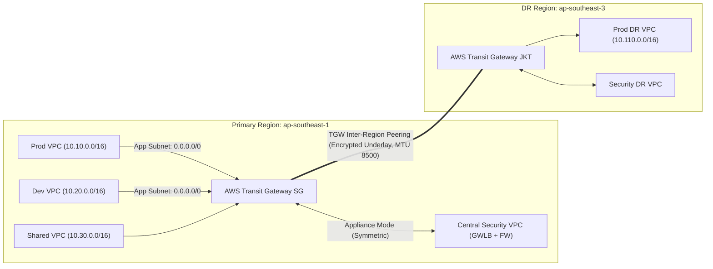
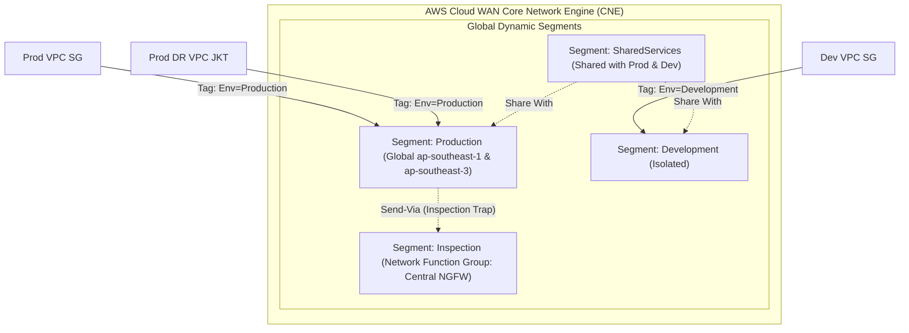

# Design Spec: AWS Cloud Network Engineering Mastery (Principal SME Standard)

- **Date:** 2026-08-22
- **Standard:** O'Reilly / McGraw-Hill / Cisco Press Technical Book Standard
- **Audience:** Senior / Staff / Principal Cloud Network Architects & Infrastructure Engineers
- **Language Policy:** High-standard professional Bahasa Indonesia with 100% original English technical terminology (RFC standard).

---

## 1. Executive Summary & Vision

Kurikulum **Cloud Network Engineering Mastery** dirancang untuk menjadi referensi teknis definitif bertaraf internasional yang setara dengan publikasi terkemuka dari O'Reilly, McGraw-Hill, dan Cisco Press. Kurikulum ini mencakup seluruh spektrum *networking* di Amazon Web Services (AWS)—mulai dari mekanika protokol dasar (RFC level), arsitektur *hardware underlay* (Nitro System & Hyperplane), *core network primitives* (VPC, ENI, Route Tables, Gateways), interkoneksi *hybrid* skala global (Direct Connect, MACsec, Cloud WAN), keamanan perimeter & inspeksi paket mendalam (GWLB, Network Firewall, WAF/Shield), hingga observasi dan investigasi insiden produksi (SEV-1 War Rooms).

Setiap modul dibangun dengan **7-Layer Deep Technical Standard** guna memastikan kedalaman analisis teknis level Principal SME (L6+ / L7).

---

---

## 2. The 7-Layer Chapter Architecture Standard (with Mandatory Industry Best Practices)

Setiap bab dalam 34 modul kurikulum wajib memenuhi 7 layer berikut dengan **Industry Best Practice** yang terintegrasi secara eksplisit:

1. **Layer 1: Protocol Mechanics & RFC Theory (RFC & Industry Standards)**
   - Bedah anatomi header paket pada tingkat byte/bit (RFC spesifikasi).
   - *State Machine* (FSM), algoritma matematis (LPM, BGP decision tree, binary bitwise, congestion control).
   - **Industry Best Practice Callout**: Kepatuhan standar internasional (e.g. RFC 7454 BGP Operations & Security, RFC 8926 GENEVE metadata tagging, TCP BBR sysctl production tuning).
2. **Layer 2: AWS Distributed Underlay & Hyperplane Internals**
   - Bagaimana AWS mengimplementasikan protokol tersebut pada *hardware* dan *software underlay*.
   - Offloading Nitro Card, Hyperplane *flow engine state machines*, SRD (*Scalable Reliable Datagram*), VPC encapsulation.
   - **Industry Best Practice Callout**: Desain arsitektur berbasis *flow placement*, optimalisasi Nitro PPS, dan pemisahan *control plane* vs *data plane*.
3. **Layer 3: AWS Resource Deep-Dive & Hard Limits (AWS Well-Architected Alignment)**
   - Analisis mendalam seluruh komponen, parameter konfigurasi, kuota lunak/keras (*soft/hard limits*), batasan MTU, dan *throughput/packet-per-second (PPS) bottleneck*.
   - **Industry Best Practice Callout**: Rekomendasi AWS Well-Architected Framework (Reliability, Security, Performance Efficiency, Cost Optimization) untuk alokasi ENI, multi-AZ deployment, NAT Gateway port scaling, dan mitigasi quota breach.
4. **Layer 4: Hop-by-Hop Packet Walkthrough & Flow Lifecycle**
   - Diagram ASCII / Mermaid yang melacak alur paket data *ingress, egress*, dan *east-west* secara mendetail lengkap dengan perubahan *header* (Layer 2, Layer 3 NAT, L4 port, tunnel encapsulation).
   - **Industry Best Practice Callout**: Pola inspeksi simetris *Zero-Trust*, pencegahan *hairpinning*, dan validasi alur paket end-to-end.
5. **Layer 5: Production Terraform IaC & CLI Implementation Blueprints**
   - Konfigurasi Terraform siap pakai (Enterprise-grade) dengan parameter produksi (bukan sekadar tutorial *hello-world*).
   - **Industry Best Practice Callout**: Tagging taxonomy, immutable infrastructure, least-privilege security groups, dan modular IaC design.
6. **Layer 6: Failure Modes, Edge Cases, Anti-Patterns & SEV-1 Troubleshooting Matrix**
   - Matriks troubleshooting berisi gejala, akar masalah (*root cause*), perintah investigasi, dan solusi perbaikan untuk skenario kegagalan nyata di produksi.
   - **Industry Best Practice Callout**: Proactive observability, CloudWatch alarms, automated failover triggers, dan runbook mitigasi insiden SEV-1.
7. **Layer 7: Principal Architect Tradeoff Framework**
   - Matriks perbandingan keputusan: Biaya ($/GB & $/hour), Latency (sub-millisecond vs inter-region), Bandwidth/PPS limit, Skalabilitas horizontal, dan *Blast Radius Isolation*.
   - **Industry Best Practice Callout**: Rekomendasi arsitektur definitif level Principal Architect untuk organisasi skala Enterprise dan Regulasi Finansial (PCI-DSS / Bank Indonesia / OJK / ISO 27001).

::: tip FORMAT STANDAR CALLOUT BEST PRACTICE
Setiap topik teori dan resource AWS wajib menyertakan kontainer khusus:
```markdown
::: tip STANDAR BEST PRACTICE INDUSTRI (SME RECOMMENDATION)
Rekomendasi konfigurasi, mitigasi risiko arsitektur, parameter tuning, dan justifikasi teknis standar Fortune 500 / Global Tier-1 Banking & Telco.
:::
```
:::

---

## 3. The 8-Part, 34-Module Book Structure

```mermaid
graph TD
    subgraph Part1["Part 1: Foundations & Protocol Physics"]
        M01["01. Subnetting, VLSM & IPAM"]
        M02["02. TCP Transport, PMTUD & BBR"]
        M03["03. Advanced BGP-4 Mastery"]
        M04["04. Overlays & SDN (VXLAN/GENEVE/IPsec)"]
        M01 --> M02 --> M03 --> M04
    end

    subgraph Part2["Part 2: Hardware Underlay & VPC Core"]
        M05["05. Nitro, ENA, ENA Express & Hyperplane"]
        M06["06. Elastic Network Interfaces (ENI, EFA, Prefix Delegation)"]
        M07["07. VPC Architecture, Multi-CIDR & RAM Sharing"]
        M05 --> M06 --> M07
    end

    subgraph Part3["Part 3: VPC Routing & Edge Gateways"]
        M08["08. Route Tables, LPM & Ingress Edge Routing"]
        M09["09. Internet Gateway (IGW) & Egress-Only IGW"]
        M10["10. AWS NAT Gateways (Public & Private NAT)"]
        M11["11. VPC Peering Architecture & Underlay Mesh"]
        M08 --> M09 --> M10 --> M11
    end

    subgraph Part4["Part 4: Private Connectivity & PrivateLink"]
        M12["12. Gateway VPC Endpoints (S3 & DynamoDB)"]
        M13["13. AWS PrivateLink & Interface VPC Endpoints"]
        M14["14. Gateway Load Balancer (GWLB) & Endpoints"]
        M12 --> M13 --> M14
    end

    subgraph Part5["Part 5: Hybrid Interconnect & Direct Connect"]
        M15["15. Direct Connect (Dedicated, Hosted, LAG, MACsec)"]
        M16["16. Direct Connect VIFs (Private, Transit, Public) & BGP"]
        M17["17. Direct Connect Gateway (DXGW) Multi-Account Multi-Region"]
        M18["18. Site-to-Site VPN & Accelerated VPN"]
        M19["19. AWS Client VPN & AWS Verified Access"]
        M15 --> M16 --> M17 --> M18 --> M19
    end

    subgraph Part6["Part 6: Enterprise WAN & Cloud WAN"]
        M20["20. AWS Transit Gateway (TGW) Core Routing"]
        M21["21. TGW Advanced: Appliance Mode, Multicast & TGW Connect"]
        M22["22. AWS Cloud WAN Global Backbone & Network Policy"]
        M20 --> M21 --> M22
    end

    subgraph Part7["Part 7: Application Networking, DNS & Edge"]
        M23["23. Elastic Load Balancing (ALB, NLB, mTLS, Proxy Protocol)"]
        M24["24. Route 53, Resolver Inbound/Outbound & DNS Firewall"]
        M25["25. CloudFront Anycast Edge & AWS Global Accelerator"]
        M26["26. AWS VPC Lattice & Modern Container Networking (EKS CNI)"]
        M23 --> M24 --> M25 --> M26
    end

    subgraph Part8["Part 8: Security, Observability & War Rooms"]
        M27["27. Security Groups vs NACLs: Deep Flow Semantics"]
        M28["28. AWS Network Firewall & Suricata Deep IPS"]
        M29["29. AWS WAF & AWS Shield Advanced DDoS Defense"]
        M30["30. Custom VPC Flow Logs, Traffic Mirroring & Reachability Analyzer"]
        M31["31. Super Enterprise Multi-Account Hub-and-Spoke Architecture"]
        M32["32. Banking & Financial Interconnect (BI-FAST / ISO 8583)"]
        M33["33. Multi-Cloud Backbone Interconnect (AWS, Azure, GCP via Equinix)"]
        M34["34. 15 Principal SEV-1 Troubleshooting War Rooms"]
        M27 --> M28 --> M29 --> M30 --> M31 --> M32 --> M33 --> M34
    end

    M04 --> M05
    M07 --> M08
    M11 --> M12
    M14 --> M15
    M19 --> M20
    M22 --> M23
    M26 --> M27
```



---

## 4. Detailed Module Syllabus & Coverage Mapping

### Part 1: Foundations & Protocol Physics
- **Modul 01: Advanced Subnetting, Supernetting, VLSM & Enterprise IPAM**
  - Bitwise operations (AND, OR, XOR), CIDR RFC 4632, Supernetting mask derivation.
  - RFC 1918, RFC 6598 (CGNAT), RFC 2544 / RFC 5737.
  - IPv6 Addressing architecture (RFC 4291: GUA, ULA, Link-local, Multicast).
  - AWS Subnet 5 reserved IP addresses mechanics.
  - AWS IPAM: IP Pools, Public IPv4 BYOIP, Multi-Account Resource Sharing, automated allocation.
- **Modul 02: L4-L7 Protocols, TCP Mechanics, MTU/MSS & Congestion Control**
  - TCP 32-bit header anatomy, TCP Options (SACK, Timestamps, Window Scaling).
  - TCP FSM & 2MSL TIME-WAIT recycling.
  - Bandwidth-Delay Product (BDP) & Linux Kernel Tuning for 100Gbps.
  - TCP Cubic vs Google BBR (v1, v2, v3) 4-state engine.
  - UDP, QUIC, HTTP/3 transport characteristics.
  - MTU Hierarchy (1500 standard vs 9001 jumbo vs 8500 TGW), PMTUD black hole mechanics & MSS Clamping.
- **Modul 03: Advanced Dynamic Routing & BGP-4 Mastery**
  - BGP-4 Message types (Open, Update, Keepalive, Notification, Route-Refresh).
  - BGP FSM (Idle, Connect, Active, OpenSent, OpenConfirm, Established).
  - BGP 13-Step Best Path Decision Algorithm.
  - BGP Communities (Standard, Extended, Large) & AWS Direct Connect Community Matrix.
  - BFD (Bidirectional Forwarding Detection - RFC 5880) sub-second failover.
  - Route Flap Dampening (RFC 2439) & MP-BGP (RFC 4760).
- **Modul 04: Overlay Networks, SDN & Tunneling Mechanics**
  - VXLAN (RFC 7348) 50-byte encapsulation & VNI mapping.
  - GENEVE (RFC 8926) variable TLV metadata header (AWS GWLB Class `0x0108`).
  - NVGRE & GRE encapsulation.
  - IPsec Architecture (IKEv1 vs IKEv2, Diffie-Hellman groups, ESP tunnel mode, DPD, NAT-T RFC 3947).

### Part 2: Hardware Underlay & VPC Core
- **Modul 05: AWS Physical Underlay: Nitro System, ENA Express & Hyperplane**
  - AWS Nitro System: Nitro Card for VPC hardware offload.
  - ENA (Elastic Network Adapter) drivers, queues, SR-IOV & DPDK.
  - ENA Express with SRD (Scalable Reliable Datagram) multi-path packet dispatching.
  - AWS Hyperplane distributed flow tracking engine (used by NAT GW, NLB, GWLB, PrivateLink).
- **Modul 06: Elastic Network Interfaces (ENI), EFA & Multi-IP Architectures**
  - Primary vs Secondary ENIs, Primary vs Secondary Private IPs, Elastic IPs (1:1 Stateless NAT).
  - IPv6 on ENI, Prefix Delegation (/28 IPv4, /80 IPv6 per ENI slot) for container density.
  - Multi-ENI routing hazards: Asymmetric return traffic & Linux policy routing (`ip rule`).
  - Elastic Fabric Adapter (EFA) & Libfabric for distributed HPC / AI/ML GPU training.
  - Source/Destination Check mechanics and EC2 placement groups (Cluster, Partition, Spread) impact on PPS/bandwidth.
- **Modul 07: Amazon VPC Deep Dive, Multi-CIDR & RAM Sharing**
  - Primary & Secondary IPv4 CIDR allocation rules, resizing constraints.
  - IPv6 Dual-Stack & IPv6-Only VPCs (DNS64 & NAT64 integration).
  - Subnet classification: Public, Private with NAT, Isolated, Transit, Edge.
  - DHCP Option Sets, DNS Hostnames & Private DNS flags.
  - AWS Resource Access Manager (RAM) Subnet Sharing across AWS Organizations accounts.

### Part 3: VPC Routing & Edge Gateways
- **Modul 08: VPC Route Table Mechanics, LPM & Ingress Edge Routing**
  - Main vs Custom Subnet Route Tables.
  - Longest Prefix Match (LPM) priority rules (Local > Static > Propagated DX/VPN).
  - Target Types (IGW, EIGW, NAT GW, VGW, TGW, VPC Peering, ENI, VPCE, Carrier GW, Local GW).
  - Ingress Edge Routing (Gateway Route Tables associated with IGW / VGW).
- **Modul 09: Internet Gateway (IGW) & Egress-Only Internet Gateway (EIGW)**
  - IGW stateless 1:1 NAT mapping in AWS Edge underlay.
  - Ingress routing table inspection redirection.
  - Egress-Only Internet Gateway for IPv6 instances (outbound-only stateful filter).
- **Modul 10: AWS NAT Gateways (Public & Private NAT Architecture)**
  - Hyperplane architecture, auto-scaling up to 100 Gbps & 4M connections.
  - Source Port Allocation & NAT Port Exhaustion (64,512 TCP connections per IP).
  - Secondary IP association on NAT Gateway for port expansion.
  - Private NAT Gateway: Overlapping CIDR translation and isolated VPC-to-On-Prem communication.
- **Modul 11: VPC Peering Architecture & Underlay Mesh**
  - Direct Nitro-to-Nitro underlay routing without hops or gateways.
  - Non-transitive routing constraint & workarounds.
  - Cross-Region VPC Peering (inter-region encryption & jumbo frames support).
  - Cross-Account Peering, Security Group referencing, and MTU behavior.

### Part 4: Private Connectivity & PrivateLink
- **Modul 12: Gateway VPC Endpoints (Amazon S3 & DynamoDB)**
  - Underlay prefix list injection into VPC Route Tables.
  - IAM Endpoint Policies (restricting actions and principals).
  - Limitations: Non-transitive access from On-Prem / VPN without proxy / S3 interface endpoints.
- **Modul 13: AWS PrivateLink & Interface VPC Endpoints**
  - Hyperplane Elastic Network Interface (Endpoint ENI).
  - Private DNS integration (Private Hosted Zone aliasing).
  - Creating Endpoint Services (Network Load Balancer / Gateway Load Balancer targets).
  - Cross-Account & Cross-Region PrivateLink, acceptance permissions, and endpoint connection state machine.
- **Modul 14: Gateway Load Balancer (GWLB) & Endpoints (GWLBe)**
  - Layer 3 Gateway + Layer 4 Load Balancing with GENEVE encapsulation.
  - 1-Arm vs 2-Arm firewall deployment models.
  - Appliance Mode symmetric hashing across AZs.
  - Horizontal scaling of Next-Gen Firewalls (Palo Alto, Fortinet, Check Point, Suricata).

### Part 5: Hybrid Interconnect & Direct Connect
- **Modul 15: AWS Direct Connect (DX) Deep Dive & Layer 2 Physical Security**
  - Dedicated (1G, 10G, 100G) vs Hosted Connections vs Hosted VIFs.
  - Meet-Me-Rooms (MMR), LOA-CFA, Cross-Connects, Optical SFPs.
  - Link Aggregation Groups (LAG) & LACP (802.3ad).
  - IEEE 802.1AE MACsec Encryption (10 Gbps & 100 Gbps wire-speed hardware encryption).
- **Modul 16: Direct Connect Virtual Interfaces (VIFs) & BGP Routing**
  - Private VIF (to VGW / DXGW), Transit VIF (to TGW via DXGW), Public VIF (accessing global AWS public endpoints).
  - BGP peering parameters, MD5 authentication, AS-Path Prepending, MED.
  - AWS Direct Connect BGP Community Tuning: Local Preference (7224:7100, 7224:7200, 7224:7300) and Scope Communities (7224:9100, 7224:9200, 7224:9300).
- **Modul 17: AWS Direct Connect Gateway (DXGW) Multi-Account & Multi-Region Backbone**
  - Multi-Region VPC Interconnect over DX.
  - Association Proposals across AWS Accounts.
  - Allowed Prefixes filtering & summary injection.
  - Transitive routing prevention on DXGW.
- **Modul 18: AWS Site-to-Site VPN & Accelerated VPN**
  - IKEv1/IKEv2 parameters, Phase 1 & Phase 2 proposals, DPD, PFS.
  - Static Routing vs Dynamic BGP Routing over IPsec.
  - ECMP (Equal-Cost Multi-Path) aggregation over VPN tunnels (up to 5 Gbps per TGW attachment).
  - AWS Accelerated Site-to-Site VPN (terminating at nearest AWS Edge location via Anycast).
  - Hybrid Redundancy: Direct Connect Primary with Automated VPN Backup using BGP metrics.
- **Modul 19: AWS Client VPN & AWS Verified Access (Zero Trust Network Access)**
  - Client VPN endpoint architecture (OpenVPN based).
  - Authentication methods: Active Directory, SAML 2.0 (Okta/Azure AD), Mutual TLS.
  - Split-tunnel vs Full-tunnel routing.
  - AWS Verified Access (ZTNA): Identity-centric, device posture evaluation without VPN tunnels.

### Part 6: Enterprise WAN & Cloud WAN
- **Modul 20: AWS Transit Gateway (TGW) Core Routing & Hub-and-Spoke**
  - TGW Underlay: Hyperplane-powered regional virtual router (50 Gbps per VPC burst).
  - TGW Route Tables, Route Associations, and Route Propagations.
  - Blackhole routes & traffic isolation (Prod, Non-Prod, Shared Services, Security).
  - TGW Inter-Region Peering (8500 MTU, inter-region AWS backbone encryption).
- **Modul 21: TGW Advanced: Appliance Mode, Multicast & TGW Connect**
  - Appliance Mode: Preventing asymmetric state drops in centralized firewall VPCs.
  - TGW Multicast: IGMPv2 protocol, Multicast Domains, Sources & Group Members in the cloud.
  - TGW Connect: Native GRE tunnels & BGP peering over VPC/Direct Connect for SD-WAN integration (Cisco SD-WAN, Fortinet, Silver Peak).
  - AWS Transit Gateway Network Manager & Global Visibility.
- **Modul 22: AWS Cloud WAN Global Backbone & Network Policy**
  - Global Software-Defined Core Network (CNE).
  - Declarative Network Policy Documents (JSON-based routing & segment isolation).
  - Core Network Segments & Segment Actions (Share, Isolate, Send-Via).
  - Hybrid Interoperability: Cloud WAN peering with existing Transit Gateways.

### Part 7: Application Networking, DNS & Edge
- **Modul 23: Elastic Load Balancing (ALB, NLB, mTLS & Proxy Protocol)**
  - ALB (Layer 7 HTTP/HTTPS/gRPC) vs NLB (Layer 4 TCP/UDP/TLS).
  - Cross-Zone Load Balancing latency vs cost tradeoffs.
  - Proxy Protocol v2 for client IP preservation through multiple proxies.
  - Mutual TLS (mTLS) termination & Client Certificate Validation at ALB.
  - Connection Draining, Deregistration Delay, and Sticky Sessions.
- **Modul 24: Amazon Route 53, Resolver Inbound/Outbound & DNS Firewall**
  - Public vs Private Hosted Zones, Split-Horizon DNS resolution.
  - Amazon Provided DNS (VPC Base IP + 2).
  - Route 53 Resolver: Inbound Endpoints (On-prem to AWS) & Outbound Endpoints (AWS to On-prem).
  - Resolver Rules (Forward, System, Auto-defined) & Domain Lists.
  - Route 53 DNS Firewall (Block, Allow, Alert, DNS Exfiltration prevention).
  - DNSSEC implementation & Anycast DNS routing algorithms (Latency, Geolocation, Geoproximity).
- **Modul 25: Amazon CloudFront Anycast Edge & AWS Global Accelerator**
  - CloudFront Architecture: Edge Locations, Regional Edge Caches (REC), Origin Shield.
  - TLS 1.3 Termination at Edge, HTTP/2 & HTTP/3 support.
  - AWS Global Accelerator: Anycast 2 Static IP addresses, 5-tuple flow hashing, Traffic Dials, Endpoint Weights, Cross-Region Failover.
- **Modul 26: AWS VPC Lattice & Modern Container Networking (EKS CNI)**
  - Amazon VPC CNI Plugin: Secondary ENIs, Prefix Delegation, Custom Networking, Security Groups for Pods.
  - AWS VPC Lattice: Service-to-service communication across VPCs and accounts without VPC Peering or TGW.
  - Service Networks, Service Associations, Auth Policies (IAM SigV4 & RBAC).

### Part 8: Security, Observability & War Rooms
- **Modul 27: Security Groups vs NACLs: Deep Flow Semantics & Connection Tracking**
  - Security Groups: Stateful flow tracking table engine, conntrack limits, untracked connections (TCP flags / UDP asymmetric).
  - Security Group Referencing across VPC Peering & Transit Gateway.
  - Network ACLs: Stateless rule evaluation, Subnet boundary enforcement, Ephemeral Port ranges (1024-65535).
- **Modul 28: AWS Network Firewall & Suricata Deep IPS**
  - Stateless Engine (Rule priorities, Actions: Pass, Drop, Forward to Stateful).
  - Stateful Engine: 5-tuple rules, Suricata rules, Domain List Filtering (SNI inspection & TLS Decryption).
  - Deployment topologies: Centralized Inspection VPC vs Distributed In-VPC Inspection.
- **Modul 29: AWS WAF & AWS Shield Advanced DDoS Defense**
  - AWS WAF WebACLs, Rule Groups, Rate-Based Rules, Bot Control, Fraud Prevention.
  - AWS Shield Standard vs Advanced: L3/L4/L7 DDoS mitigation, Route 53 DDoS protection, Cost Protection against scaling spikes, Shield Response Team (SRT) manual mitigation.
- **Modul 30: Custom VPC Flow Logs, Traffic Mirroring & Reachability Analyzer**
  - Custom VPC Flow Logs format fields (`tcp-flags`, `pkt-srcaddr`, `pkt-dstaddr`, `flow-direction`, `traffic-path`).
  - Analyzing Flow Logs with Amazon Athena.
  - AWS Traffic Mirroring: VXLAN capture sessions, Filter rules, Target (NLB / ENI).
  - AWS VPC Reachability Analyzer & Network Access Analyzer: Formal mathematical verification of path reachability without injecting test packets.
- **Modul 31: Super Enterprise Multi-Account Hub-and-Spoke Architecture**
  - AWS Organizations, Control Tower, Core Network Services Account, Central Egress VPC, Central Ingress DMZ VPC, East-West Inspection VPC.
- **Modul 32: Financial & Banking Partner Interconnect (BI-FAST / ISO 8583)**
  - Interconnecting with central switching networks (Arthajasa, Alto, Rintis, BI-FAST).
  - Overlapping RFC 1918 addresses resolution using Private NAT Gateways & Bidirectional NAT.
  - Strict HSM (Hardware Security Module) & PCI-DSS network segmentation.
- **Modul 33: Multi-Cloud Backbone Interconnect (AWS + Azure ExpressRoute + GCP Interconnect)**
  - Multi-Cloud routing via Equinix Fabric / Megaport Cloud Router (MCR).
  - BGP peering across clouds, AS-Path loop prevention, metric normalization.
- **Modul 34: 15 Principal SEV-1 Troubleshooting War Rooms**
  - 15 production failure drill scenarios:
    1. Direct Connect BGP Session Flapping during maintenance.
    2. Asymmetric Routing Black Hole across Centralized Firewall VPC.
    3. PMTUD Black Hole on Hybrid Direct Connect Jumbo Frames.
    4. NAT Gateway SNAT Port Exhaustion during flash sales.
    5. Route 53 Hybrid DNS Resolution Loop between On-Prem BIND and Resolver Endpoints.
    6. EKS Pod IP Exhaustion & Subnet Fragmentation.
    7. Multi-ENI EC2 Instance Asymmetric Drop.
    8. Transit Gateway Missing Return Route / Blackhole Trap.
    9. Cross-Account PrivateLink DNS Resolution Mismatch.
    10. Security Group Conntrack Table Exhaustion under UDP flood.
    11. Network ACL Ephemeral Port Denial on return traffic.
    12. Direct Connect Failover to VPN Routing Loop.
    13. AWS Network Firewall Suricata Rule Syntax Error causing Silent Drops.
    14. Gateway Load Balancer GENEVE TLV Option Drop on Third-Party Appliance.
    15. Cloud WAN Segment Policy Propagation Desynchronization.

---

## 6. Enterprise Case Studies: Multi-VPC Multi-Region Architecture & Detailed Configurations

### 6.1. Skenario Produksi Enterprise Global
Arsitektur enterprise modern melibatkan interkoneksi lintas VPC dan lintas Region dengan kebutuhan:
1. **Primary Region (`ap-southeast-1` Singapore)**:
   - **Production VPC (`10.10.0.0/16`)**: Tier App (`10.10.1.0/24`), Tier DB (`10.10.10.0/24`), Tier Transit Subnet (`10.10.254.0/28`).
   - **Non-Production VPC (`10.20.0.0/16`)**: Tier Dev/Staging (`10.20.1.0/24`), Tier Transit Subnet (`10.20.254.0/28`).
   - **Shared Services VPC (`10.30.0.0/16`)**: Shared CI/CD, Monitoring, Active Directory, Inbound/Outbound Route 53 Resolver Endpoints (`10.30.1.0/24`).
   - **Central Security & Inspection VPC (`10.100.0.0/16`)**: Transit Subnet (`10.100.254.0/28`), GWLB Endpoint Subnet (`10.100.1.0/24`), Firewall Subnet (`10.100.2.0/24`), Public NAT Subnet (`10.100.0.0/24`).
2. **Disaster Recovery (DR) Region (`ap-southeast-3` Jakarta)**:
   - **Production DR VPC (`10.110.0.0/16`)**: Tier App DR (`10.110.1.0/24`), Tier DB DR (`10.110.10.0/24`), Transit Subnet (`10.110.254.0/28`).
   - **Security DR VPC (`10.200.0.0/16`)**: Inspection & Outbound Egress DR.

---

### 6.2. Granularitas Subnet-Level Routing (The Gold Standard)

::: danger ANTI-PATTERN: MENGASOSIASIKAN APPLICATION SUBNET KE TGW/WAN
Jangan pernah membuat attachment TGW atau Cloud WAN pada subnet aplikasi/database yang sama. Selalu sediakan **Dedicated Transit Subnet (`/28`)** per AZ di setiap VPC untuk ENI attachment TGW/Cloud WAN guna mencegah *routing loops* dan konflik LPM.
:::

#### Matriks Route Table pada Subnet Level (Spoke VPC):
1. **Application Subnet Route Table**:
   - `10.10.0.0/16` ➔ `local` (Intra-VPC communication)
   - `0.0.0.0/0` ➔ `tgw-attach-xxxx` (Seluruh traffic keluar dan antar-VPC diarahkan ke Central Security VPC)
2. **Database Subnet Route Table (Air-Gapped & Strict Replication)**:
   - `10.10.0.0/16` ➔ `local`
   - `10.110.10.0/24` ➔ `tgw-attach-xxxx` (Hanya rute spesifik ke DB DR di Jakarta via TGW/Cloud WAN)
   - *Tidak memiliki default route `0.0.0.0/0`* (Terisolasi total dari Internet & Egress)
3. **Dedicated Transit Subnet Route Table**:
   - `10.10.0.0/16` ➔ `local`
   - *Hanya rute lokal*, tidak boleh mengarah balik ke TGW untuk menghindari infinite loop.

---

### 6.3. Opsi Implementasi A: Multi-Region AWS Transit Gateway (TGW) Peering Mesh



#### Langkah Konfigurasi Teknis TGW Multi-Region:
1. **Buat TGW di masing-masing Region**:
   - Nonaktifkan `Default Route Table Association` dan `Default Route Table Propagation` untuk kontrol isolasi manual level SME.
2. **Aktifkan Appliance Mode pada Security VPC Attachment**:
   - Memastikan aliran traffic dua arah (*bidirectional flow*) masuk dan keluar pada ENI firewall di AZ yang sama persis (mencegah *state drop* pada stateful firewall).
3. **Inisiasi & Terima TGW Peering**:
   - Buat peering attachment dari `tgw-sg` ke `tgw-jkt`, lalu *Accept* peering attachment di Region Jakarta.
4. **Segregasi TGW Route Tables**:
   - **Spoke Route Table (`tgw-rtb-spoke`)**: Di-associate ke Prod, Dev, Shared. Memiliki static default route `0.0.0.0/0` diarahkan ke *Security VPC Attachment*.
   - **Security/Inspection Route Table (`tgw-rtb-sec`)**: Di-associate ke Security VPC Attachment. Mempropagasi CIDR seluruh Spoke (`10.10.0.0/16`, `10.20.0.0/16`, `10.30.0.0/16`) dan memiliki static route `10.110.0.0/16` ke *TGW Peering Attachment*.
   - **Cross-Region Peering Route Table**: Menghubungkan traffic antar-region langsung ke rute inspeksi tujuan.

#### Blueprint Terraform (TGW Multi-Region + Peering + Route Table Segregation):

```hcl
# 1. Transit Gateway Primary Region (Singapore)
resource "aws_ec2_transit_gateway" "sg" {
  description                     = "Primary Hub TGW Singapore"
  auto_accept_shared_attachments  = "disable"
  default_route_table_association = "disable"
  default_route_table_propagation = "disable"
  dns_support                     = "enable"
  vpn_ecmp_support                = "enable"

  tags = {
    Name        = "tgw-primary-singapore"
    Environment = "Production"
  }
}

# 2. Transit Gateway DR Region (Jakarta)
resource "aws_ec2_transit_gateway" "jkt" {
  provider                        = aws.jakarta
  description                     = "DR Hub TGW Jakarta"
  auto_accept_shared_attachments  = "disable"
  default_route_table_association = "disable"
  default_route_table_propagation = "disable"
  dns_support                     = "enable"

  tags = {
    Name        = "tgw-dr-jakarta"
    Environment = "DR"
  }
}

# 3. TGW Inter-Region Peering Attachment
resource "aws_ec2_transit_gateway_peering_attachment" "sg_to_jkt" {
  peer_account_id         = data.aws_caller_identity.current.account_id
  peer_region             = "ap-southeast-3"
  peer_transit_gateway_id = aws_ec2_transit_gateway.jkt.id
  transit_gateway_id      = aws_ec2_transit_gateway.sg.id

  tags = {
    Name = "tgw-peering-sg-to-jkt"
  }
}

resource "aws_ec2_transit_gateway_peering_attachment_accepter" "jkt_accept" {
  provider                      = aws.jakarta
  transit_gateway_attachment_id = aws_ec2_transit_gateway_peering_attachment.sg_to_jkt.id

  tags = {
    Name = "tgw-peering-jkt-accepter"
  }
}

# 4. Security VPC Attachment with Appliance Mode Enabled
resource "aws_ec2_transit_gateway_vpc_attachment" "sec_vpc_sg" {
  transit_gateway_id = aws_ec2_transit_gateway.sg.id
  vpc_id             = aws_vpc.sec_sg.id
  subnet_ids         = aws_subnet.sec_sg_transit[*].id

  appliance_mode_support = "enable" # MANDATORY for Stateful Firewall Symmetry!

  tags = {
    Name = "tgw-attach-sec-vpc-appliance-mode"
  }
}

# 5. Route Table Segregation & Cross-Region Route
resource "aws_ec2_transit_gateway_route_table" "spokes_rt" {
  transit_gateway_id = aws_ec2_transit_gateway.sg.id
  tags               = { Name = "tgw-rtb-spokes" }
}

resource "aws_ec2_transit_gateway_route" "spokes_to_security" {
  destination_cidr_block         = "0.0.0.0/0"
  transit_gateway_attachment_id  = aws_ec2_transit_gateway_vpc_attachment.sec_vpc_sg.id
  transit_gateway_route_table_id = aws_ec2_transit_gateway_route_table.spokes_rt.id
}

resource "aws_ec2_transit_gateway_route" "cross_region_to_jkt" {
  destination_cidr_block         = "10.110.0.0/16"
  transit_gateway_attachment_id  = aws_ec2_transit_gateway_peering_attachment.sg_to_jkt.id
  transit_gateway_route_table_id = aws_ec2_transit_gateway_route_table.spokes_rt.id
}
```

---

### 6.4. Opsi Implementasi B: Global AWS Cloud WAN Core Network (CNE)

AWS Cloud WAN menyediakan *Global Software-Defined WAN* di mana seluruh *edge* antar-region dan kebijakan segmentasi diatur secara terpusat melalui satu dokumen deklaratif: **Global Core Network Policy (JSON)**.



#### Master JSON Policy Cloud WAN (Multi-Region, Multi-Segment, Send-Via Inspection):

```json
{
  "version": "2021.12",
  "core-network-configuration": {
    "asn-ranges": ["64512-64555"],
    "edge-locations": [
      { "location": "ap-southeast-1", "asn": 64512 },
      { "location": "ap-southeast-3", "asn": 64513 }
    ],
    "inside-cidr-blocks": ["10.250.0.0/16"]
  },
  "segments": [
    {
      "name": "production",
      "require-attachment-acceptance": false,
      "isolate-attachments": false,
      "description": "Production Workloads Segment across SG and JKT"
    },
    {
      "name": "development",
      "require-attachment-acceptance": false,
      "isolate-attachments": true,
      "description": "Isolated Development Workloads"
    },
    {
      "name": "sharedservices",
      "require-attachment-acceptance": false,
      "isolate-attachments": false,
      "description": "Shared Tooling & DNS Resolvers"
    },
    {
      "name": "inspection",
      "require-attachment-acceptance": false,
      "isolate-attachments": false,
      "description": "Central Security Network Function Group"
    }
  ],
  "network-function-groups": [
    {
      "name": "sec-firewall-nfg",
      "require-attachment-acceptance": false,
      "description": "Centralized Stateful Firewall Inspection Group"
    }
  ],
  "segment-actions": [
    {
      "action": "share",
      "segment": "sharedservices",
      "share-with": ["production", "development"]
    },
    {
      "action": "send-via",
      "segment": "production",
      "network-function-group-name": "sec-firewall-nfg",
      "when-sent-to": { "segments": ["*"] }
    }
  ],
  "attachment-policies": [
    {
      "rule-number": 100,
      "condition-logic": "and",
      "conditions": [
        { "type": "tag-value", "key": "Environment", "operator": "equals", "value": "Production" }
      ],
      "action": {
        "association-method": "constant",
        "segment": "production"
      }
    },
    {
      "rule-number": 200,
      "condition-logic": "and",
      "conditions": [
        { "type": "tag-value", "key": "Environment", "operator": "equals", "value": "Development" }
      ],
      "action": {
        "association-method": "constant",
        "segment": "development"
      }
    },
    {
      "rule-number": 300,
      "condition-logic": "and",
      "conditions": [
        { "type": "tag-value", "key": "NetworkRole", "operator": "equals", "value": "SecurityFirewall" }
      ],
      "action": {
        "association-method": "constant",
        "segment": "inspection",
        "tag-network-function-group": "sec-firewall-nfg"
      }
    }
  ]
}
```

#### Blueprint Terraform (Cloud WAN Core Network Deployment):

```hcl
# 1. Global Network Manager
resource "aws_networkmanager_global_network" "enterprise" {
  description = "Enterprise Global Backbone Network"
  tags = {
    Name = "global-network-enterprise"
  }
}

# 2. AWS Cloud WAN Core Network
resource "aws_networkmanager_core_network" "core" {
  global_network_id = aws_networkmanager_global_network.enterprise.id
  description       = "Multi-Region Cloud WAN Core Network (SG & JKT)"
  policy_document   = file("${path.module}/core-network-policy.json")

  tags = {
    Name = "cne-enterprise-core"
  }
}

# 3. Subnet-Level VPC Attachment (Mapped automatically via Tags)
resource "aws_networkmanager_vpc_attachment" "prod_sg_attach" {
  core_network_id = aws_networkmanager_core_network.core.id
  vpc_arn         = aws_vpc.prod_sg.arn
  subnet_arns     = [for s in aws_subnet.prod_sg_transit : s.arn]

  tags = {
    Name        = "wan-attach-prod-sg"
    Environment = "Production" # Automatically evaluated by Policy Rule 100
  }
}
```

---

### 6.5. Matriks Perbandingan Arsitektur: Multi-Region TGW Mesh vs AWS Cloud WAN

| Parameter Arsitektur | Multi-Region AWS Transit Gateway (TGW) | AWS Cloud WAN (Core Network) |
|---|---|---|
| **Model Operasional** | Regional Decoupled (Dikelola per-region via Peering Attachments) | Global Centralized (Satu deklaratif Global Network Policy JSON) |
| **Kompleksitas Scaling** | Kompleksitas $O(N^2)$ pada banyak region (harus membuat & me-maintain peering mesh & static routes manual di tiap TGW) | Skala otomatis $O(1)$: Cukup tambahkan `edge-location` baru pada policy JSON |
| **Inter-Segment Routing Policy** | Manual Route Table Associations, Propagations, & Blackhole routes | Native Segment Actions (`share`, `isolate`, `send-via`) |
| **Service Insertion (Firewall/IPS)** | Membutuhkan Appliance Mode pada Attachment + manual route piping | Native **Network Function Groups (NFG)** dengan aksi `send-via` otomatis |
| **MTU / Maximum Transmission Unit** | **8500 bytes** antar-Region Peering, **9001 bytes** intra-VPC | **8500 bytes** antar Core Network Edges |
| **Biaya Attachment & Data Processing** | $0.05/attachment/jam + $0.02/GB data + Inter-Region data transfer | $0.05/attachment/jam + $0.02/GB data + Core Network Edge fee ($0.25/jam/region) |
| **Kapan Harus Memilih?** | Cocok untuk arsitektur 1-2 Region sederhana, atau jika membutuhkan kontrol route granular per-perangkat tanpa Network Manager | **Standar Emas Enterprise Multi-Region (3+ Region)** dengan puluhan hingga ratusan VPC dan kepatuhan audit segmentasi ketat |

---

---

## 7. Interactive Simulators & Hands-on IaC Suite

### 7.1. Dual-Mode Interactive UX Standard
Setiap simulator interaktif dirancang dalam arsitektur **Dual-Mode**:
1. **Dedicated Interactive Hub (`/interactive/*`)**: Halaman simulator penuh dengan kanvas kontrol interaktif, visualisasi SVG/Canvas responsif, dan panel debugging mendalam.
2. **Embedded In-Chapter Widgets**: Komponen Vue 3 yang di-embed langsung pada bab-bab terkait menggunakan `<ClientOnly>` untuk pengalaman belajar hands-on instan tanpa berpindah halaman:
   - Modul 01: `<CidrCalculator />`
   - Modul 03: `<BgpSimulator />`
   - Modul 04: `<PacketTracer />`
   - Modul 08: `<AwsRouteSandbox />`
   - Modul 16: `<DxCommunityCalc />`
   - Modul 22 & 31: `<TopologyExplorer />`
   - Modul 27: `<ConntrackCalculator />`
   - Modul 34: `<TroubleshootingDrills />`

### 7.2. Katalog 8 Interactive Web Tools (`docs/interactive/`):
1. `cidr-calculator.md`: CIDR & IPAM Hierarchy Allocator (IPv4 & IPv6).
2. `bgp-simulator.md`: BGP 13-Step Decision Simulator & Community Filter.
3. `packet-tracer.md`: Hop-by-Hop Packet Flow & Encapsulation Tracer (GENEVE/VXLAN/IPsec).
4. `aws-sandbox.md`: AWS Route Table LPM Resolver & Hybrid Route Sandbox.
5. `topology-explorer.md`: Interactive Global Hub-and-Spoke & Cloud WAN Topology Explorer.
6. `troubleshooting-drills.md`: 15 Interactive SEV-1 War Room Diagnostic Drills.
7. `dx-community-calc.md`: AWS Direct Connect BGP Community & Path Metric Calculator.
8. `conntrack-calculator.md`: Security Group Conntrack & NAT Gateway Port Calculator.

### 7.3. Standar Produksi 7 Terraform IaC Blueprints (`labs/`):
Setiap blueprint lab dalam direktori `labs/<id>-<name>/` wajib mengikuti arsitektur modular production-ready:
- `main.tf`: Provider setup (AWS Provider `~> 5.0`) dan deklarasi resource terstruktur.
- `variables.tf`: Deklarasi variabel lengkap dengan `type`, `description`, dan `default` value yang realistis.
- `outputs.tf`: Export nilai esensial (VPC IDs, ENI IPs, TGW Attachment IDs, Route Table IDs, DNS names).
- `terraform.tfvars.example`: Contoh variabel untuk deployment langsung.
- `README.md`: Diagram topologi (ASCII/Mermaid), instruksi *deployment*, dan **Step-by-step Verification Runbook** menggunakan perintah AWS CLI, ping, traceroute, dan curl.

Katalog 7 Hands-on Labs:
1. `01-enterprise-ipam-vpc`: Multi-Tier VPC with IPv4/IPv6 Dual-Stack & Automated IPAM.
2. `02-tgw-gwlb-appliance-mode`: Centralized Inspection Hub with TGW, GWLB, and Suricata NGFW.
3. `03-cloud-wan-core-network`: Multi-Region AWS Cloud WAN with Policy Segments.
4. `04-financial-partner-private-nat`: Bidirectional Private NAT for Overlapping Banking Interconnect.
5. `05-hybrid-direct-connect-vpn-bfd`: High-Availability Direct Connect with BFD & Automated VPN Failover.
6. `06-vpc-lattice-microservices`: Zero-Trust Multi-Account Microservices with VPC Lattice.
7. `07-centralized-ingress-egress-firewall`: Centralized Ingress DMZ (ALB/NLB) + Egress Network Firewall.

### 7.4. Standar Pembahasan Hands-on Labs & Use Cases (6-Point Step Blueprint)
Untuk menjamin pemahaman konsep dan eksekusi teknis tingkat buku penerbit besar (O'Reilly / McGraw-Hill / Cisco Press), setiap langkah pada seluruh 7 Lab Guide (`docs/labs/*.md`) dan Case Study mendalam wajib mengikuti **6-Point Step Blueprint**:

1. **Tujuan & Rasionil Arsitektur (*Architectural Intent*)**:
   - Menjelaskan mengapa langkah tersebut dilakukan, prinsip desain yang melandasinya, dan peran komponen dalam topologi end-to-end.
2. **Pemetaan Konsep AWS Console (*AWS Console Context & Parameter Mapping*)**:
   - Menjelaskan letak menu/fitur pada AWS Management Console (e.g. *VPC Dashboard > Transit Gateway Attachments > Create Attachment*) dan pemetaan parameter kritis (dropdown, checkbox, value input).
3. **Perintah AWS CLI Produksi (*Human-Readable Production AWS CLI*)**:
   - Perintah AWS CLI yang diformat bersih per baris (`\`), tabel/penjelasan flag-flag penting, dan filter output menggunakan `--query` (JMESPath) untuk lingkungan otomasi.
4. **Deklarasi Terraform IaC (*Declarative Blueprint*)**:
   - Blok kode HCL padanan untuk provisioning deklaratif yang dapat diaudit.
5. **Mekanika Underlay (*Under-the-Hood Mechanics*)**:
   - Apa yang terjadi di balik layar pada level fisik/logis (Nitro Card ASIC, Hyperplane state tables, route table state machines, atau enkapsulasi Geneve/VXLAN).
6. **Uji Verifikasi & Smoke Test (*Verification Runbook*)**:
   - Perintah verifikasi deterministik (`aws ... describe-...`, `ping`, `curl`, `dig`, `traceroute`) dengan contoh output aktual (JSON/tabel) untuk memvalidasi keberhasilan langkah.


---

## 8. Format Standar SEV-1 Incident Post-Mortem (Modul 34)

Setiap skenario dari **15 SEV-1 Production Incidents** pada Modul 34 wajib ditulis dengan format **Incident Post-Mortem & Triage Runbook (7-Section SME Standard)**:

1. **Skenario & Dampak Produksi (*Production Impact & Alert*)**:
   - Contoh trigger alert Datadog / CloudWatch / PagerDuty, metrik kegagalan (e.g. *Elevated 5xx errors, packet drop > 40%, BGP state change: Established to Idle*).
2. **Topologi Masalah & Diagram Alur Data (*Incident Topology*)**:
   - Diagram Mermaid/ASCII yang menunjukkan di titik mana paket data ter-drop atau berputar dalam loop.
3. **Triase & Investigasi Step-by-Step (*Triage & CLI Commands*)**:
   - Perintah investigasi aktual (`aws ec2 describe-...`, Athena SQL queries on VPC Flow Logs, `tcpdump -nnvv -i eth0`, `mtr`, `nping`).
4. **Analisis Akar Masalah (*Root Cause Analysis - RCA*)**:
   - Penjelasan teknis mendalam mengenai fenomena fisik/underlay yang mendasari insiden (e.g. *Nitro connection tracking table exhaustion, asymmetric state drop, BGP MED overriding local preference*).
5. **Mitigasi Cepat / Hotfix (*Immediate Remediation*)**:
   - Langkah cepat untuk memulihkan traffic produksi dalam hitungan menit (e.g. *Static route injection, clearing conntrack, manual failover*).
6. **Solusi Arsitektur Permanen (*Permanent Architectural Fix*)**:
   - Perubahan Terraform / arsitektur jaringan untuk mengeliminasi akar masalah secara permanen.
7. **Pencegahan Proaktif & Alarm Monitoring (*Proactive Prevention & Detection*)**:
   - Metrik CloudWatch spesifik, filter metrik VPC Flow Logs, dan threshold alarm untuk mendeteksi anomali sebelum memicu SEV-1.

---

## 9. VitePress Navigation & Site Structure

Struktur navigasi (`docs/.vitepress/config.mts`) akan di-update secara penuh untuk menampilkan hierarki 8-Part (34 Modul), 8 Interactive Tools, 7 Terraform Labs, dan Quick Reference Cheat Sheet secara rapi dengan sidebar collapsible.


